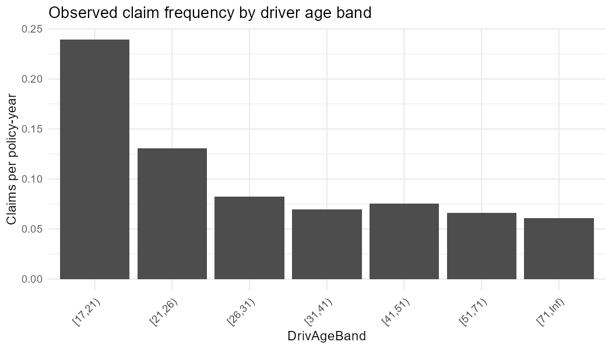
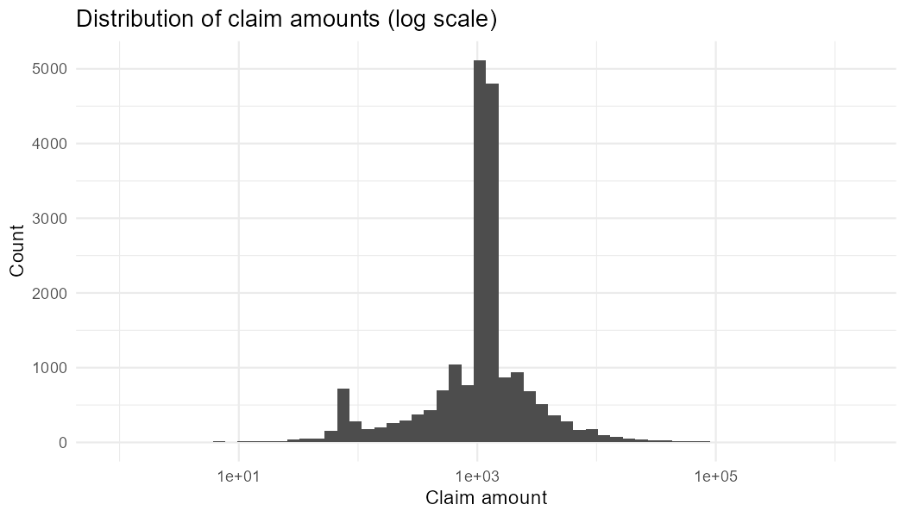
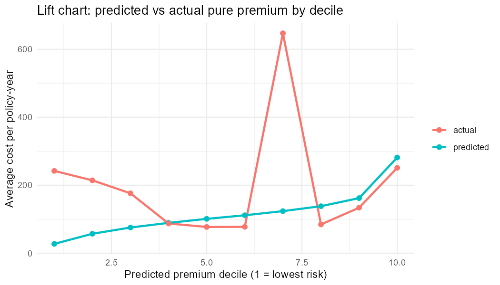

# Motor Insurance Pricing with GLMs

A frequency-severity pricing model for French motor third-party liability
insurance, built in R. I fit separate GLMs for claim frequency and claim
severity, combine them into a pure premium, and then actually test whether
the result beats a flat rate on held-out data - which turned out to matter
more than I expected.

## Data

French Motor Third-Party Liability data, from the `CASdatasets` R package:

- `freMTPL2freq`: policy-level exposure and claim counts
- `freMTPL2sev`: individual claim amounts

A few data quality issues needed handling before any of this was useful.
Exposure is meant to be a fraction of a policy year but a small number of
rows go above 1, so I capped those at 1 rather than dropping them. ClaimNb
had a handful of implausibly high values, capped at 4. And `freMTPL2sev` has
a noticeable cluster of claims valued at exactly 1200, which is a known
artefact of this dataset rather than a coincidence - I kept these in since
there's no way to tell a genuine 1200 claim apart from the artefact, and
dropping them would understate frequency. All of this is in `1_data_prep.R`.

## Method

**Frequency.** Poisson GLM, log link, with `log(Exposure)` as an offset so
the model targets claims per policy-year rather than raw counts. Rating
factors: driver age band, vehicle age band, vehicle power, fuel type, area,
bonus-malus. I tried region and population density too, but they added
basically nothing once area and bonus-malus were already in, so they're out
of the final model. Dispersion came out at 1.678, above the usual 1.2
threshold, so the model refits itself as quasi-Poisson - same coefficients,
correct standard errors.

**Severity.** Gamma GLM, log link, fitted only on policies with at least one
claim, weighted by claim count. I tried vehicle age, fuel type, driver age
and region here too; none of them were significant, so the final model just
has vehicle power and area. Claims are capped at their 99th percentile
(16,358) before fitting - a couple of huge claims were otherwise dragging the
whole model around - and the amount above that cap gets added back as a flat
loading per claim (538) instead of pretending vehicle power and area can
explain it, because they can't.

**Pure premium.** Predicted frequency times predicted severity. This is
expected claims cost only - no expenses, commission, profit loading,
reinsurance or cost of capital - so don't mistake it for an actual premium.




## Results

The frequency side works and I can back that up. The relativities have a
shape I'd expect from any motor book: risk is highest for the youngest
driver band, drops to about 0.6-0.7x through the 20s and 30s, then creeps
back up a bit for older drivers. Vehicle power runs from roughly 1.1x up to
1.4x for the most powerful cars, area goes from 1.0 up to 1.55x for the
busiest areas, and every point of bonus-malus adds about 2.7% to expected
frequency. None of that needed nudging to look sensible - it's just what
came out of the fit.

I ran 5-fold cross-validation to check this wasn't a fluke of one split, and
it held up: frequency-only Gini across the five folds was 0.073, 0.082,
0.074, 0.075, 0.076 - mean 0.076, sd 0.0035. Barely moves between folds,
which is what I was hoping to see.

The pure premium is a different story, and I want to be upfront about it
rather than bury it. On my first 80/20 split, adding the large-loss cap took
the Gini from -0.108 to +0.032, and for a while I thought that was the fix.
Then I ran the same thing across 5 folds and the number bounced all over the
place: 0.106, -0.027, 0.070, -0.040, -0.069. Mean of 0.008 against a standard
deviation of 0.076 - the noise is nearly ten times the size of the average.
A bootstrap on the original split gave a 95% interval of [-0.116, 0.136],
which straddles zero comfortably. So no, I can't claim the combined
pure-premium model reliably beats a flat rate here. I could've just kept the
first split's numbers and left it there, but once I saw how much they moved
around under CV that didn't feel honest to write up.

What's actually going on is there just aren't enough large claims to prove
this out - something like 4,000 claims in a typical fold, and severity is
dominated by a handful of very large ones that vehicle power and area were
never going to explain. That's a property of the data, not a mistake in the
model. Frequency has plenty of signal to work with; severity, at this
sample size, doesn't - at least not enough to show up cleanly at the
combined pure-premium level.

I went one step further to see if that was fixable. The instability above
comes from testing the model against raw, uncapped actual cost - including
the exact large claims the severity model was deliberately built not to
chase. So I re-ran the evaluation two ways at once: pooling every fold's
held-out predictions into one ~678,000-row test instead of five ~135,000-row
ones, and testing the model's attritional premium (frequency times capped
severity, no excess loading) against the actual cost capped the same way.
That's testing the claim the model was actually built to make, with as much
data as this dataset allows.

It helped, but didn't fully settle it. The attritional Gini came out at
0.0077, and the flat baseline's own noise collapsed from a standard
deviation of 0.169 down to 0.0067 once the heavy tail was properly excluded
- confirming that was the right diagnosis. But the bootstrap 95% CI on that
result was [-0.0089, 0.0238], which still just barely straddles zero. So the
honest answer is: this is about as close to a real signal as I could get out
of this dataset using the correct methodology, and it's still not quite
enough to call statistically significant at the conventional 95% level.

Full numbers are in `output/lift_table.csv`, `output/summary_metrics.csv`,
`output/cv_results.csv` and `output/cv_summary.csv` if you want to check any
of this yourself.



## Limitations

- Bonus-malus is partly built from past claims, so using it as a rating
  factor is a bit circular even though it clearly predicts well here.
- No interaction terms - driver age x vehicle power is the obvious one I
  didn't get to.
- The pure-premium Gini doesn't hold up under cross-validation (see
  Results above), even after correcting the evaluation to test the model's
  attritional premium against capped actual cost with the full 678K rows
  pooled out-of-fold. The result got meaningfully closer to significant
  (bootstrap CI narrowed to [-0.0089, 0.0238], compared to [-0.116, 0.136]
  on the raw evaluation) but didn't quite clear it. A genuinely larger
  claims dataset is the only thing I can see that would settle this either
  way.
- One dataset, one market, one period in time - this isn't a general claim
  about how motor risk works, just what this particular slice of data shows.

## Running it

```
R/1_data_prep.R              # installs packages if needed, loads, cleans, splits
R/2_exploratory_analysis.R   # frequency plots by rating factor
R/3_pricing_models.R         # fits the models, writes output/ and figures/
R/4_cross_validation.R       # 5-fold CV + bootstrap CI on the Gini result
```

Needs `CASdatasets`, `dplyr`, `ggplot2`, `tidyr`. `CASdatasets` isn't on
CRAN - `1_data_prep.R` installs it from its own repository the first time
you run it.
